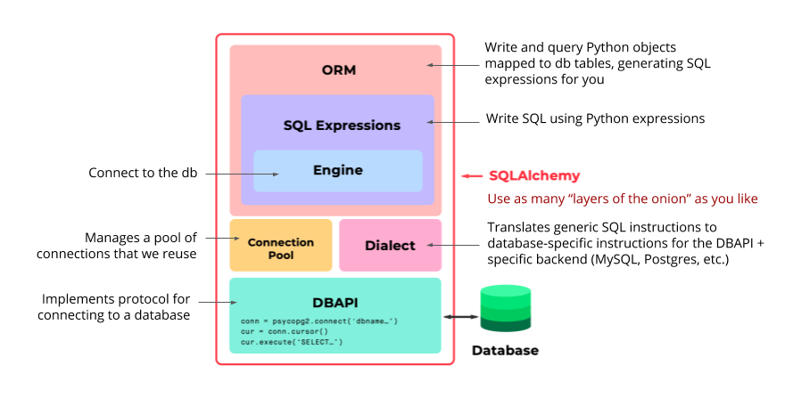
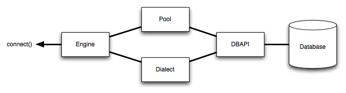

## Full-Stack Developer

Tech stack we'll be gaining proficiency in:

* Python 3
* Flask
* PostgresSQL
* psycopg2 (wrapper around libpq)
* SQLAlchemy
* Flask-SQLAlchemy

Required Software

* CLI: Terminal or GitBash
* Python (version 3.7 or later)
* PIP
* Code Editor
* Web Browser
---
### PostgreSQL CLI

Start psql with a connection to dbname. Optionally useanother user than current user: 

`psql` `<dbname> [<username>]`

Logging in connects to default DB (ssi112 in my case).  To show the current search path you can use the following command:

`SHOW search_path;`

And to put the new schema in the path, you could use:

`SET search_path TO myschema;`

On local installation: `set search_path to sakila;`

Or if you want multiple schemas: `SET search_path TO myschema, public;`

Otherwise, will need to enter full DB and schema to access tables.

`select * from ssi112.sakila.actor`

**Other PSQL commands:**

Connect to a specific DB when logging in:  `psql <dbname>`

Once logged in connect to a specifc DB: `\c` `<dbname>`

List all DBs on server `\l`

Show table info (can set the search path first to eliminate the schema): `\d sakila.actor`

`SET search_path TO sakila;`

Now show all DB tables: `\dt`

Quit the CLI: `\q`

**Typical Default Connection Settings**

Connection Setting | Default
-------------------- | --------------
Host | localhost (aka, 127.0.0.1)
Port | 5432
Username | postgres
Password | (None)

---
### SQLAlchemy

SQLAlchemy offers multiple ways of interacting with DB. 

* Can interact with Engine layer and send SQL statements to DB.
* Can create Python objects and send SQL expressions to DB.
* Use the ORM (highest level)

**Good Design Practice (Opinion)**

Interacting with databases using good design practice:

* Keep your code Pythonic. Work in classes and objects as much as possible.
* Makes switching to a different backend easy in the future.
 * Avoid writing raw SQL until absolutely necessary

**Layers of SQLAlchemy**



* DBAPI (uses psycopg2 under the hood)
* The [Dialect](https://docs.sqlalchemy.org/en/13/dialects/)
* The [Connection Pool](https://docs.sqlalchemy.org/en/13/core/pooling.html)
* The [Engine](https://docs.sqlalchemy.org/en/13/core/engines.html)
* SQL Expressions
* SQLAlchemy ORM (optional)

_Can use SQLAlchemy to communicate with DB using any of the three layers of abstraction: ORM, Expressions level, or use the DBAPI level._

**The Dialect** - abstracts away the specific database system we are using so we do not need to use SQL specific to that DBMS. Makes it possible to interact with any DBMS.

**Connection Pooling** - don't need to open/close DB connections manually.

* Handles dropped connections
* Avoids many small calls to the DB
* Avoids opening and closing connections for every change

**The Engine** - don't need to open/close DB connections manually. Lowest level of abstraction - similar to using psycopg2. The Engine in SQLAlchemy refers to both _itself, the Dialect and the Connection Pool_, which all work together to interface with our database.



**SQL Expressions** - use Python objects to create SQL expressions. Although, they require you to know SQL they are a step above and avoid writing SQL string compositions in your code.


**SQL ORM** - Highest level of abstraction. Create Python classes that map to DB objects. Wraps the Expressions and Engine layer.

---
### SQLAlchemy ORM: Mapping Between Tables and Classes

Can think of a DB table as a template for future rows to fill the table. Columns are attributes of the table object. Python classes are similar in that classes have attributes that can match the columns in the table.

* Tables map to classes
* Table records map to class objects
* Table columns map to class attributes

---
Flask [documentation](https://flask.palletsprojects.com/en/1.1.x/)

Flask SQLAlchemy [documentation](https://flask-sqlalchemy.palletsprojects.com/en/2.x/)

Install from command line using pip or pip3:
`pip install flask`
`pip install flask-sqlalchemy`

**_See demos/flask_hello.py for basic usage of Flask and SQLAlchemy_**

Database Connection URI Parts:


**SQLAlchemy Data Types**

Type | Description
----- | -----------------
Integer | an integer
String(size) | a string with a maximum length (optional in some databases, e.g. PostgreSQL)
Text | some longer unicode text
DateTime | date and time expressed as Python datetime object.
Float | stores floating point values
Boolean | stores a boolean value
PickleType | stores a pickled Python object
LargeBinary | stores large arbitrary binary data

SQLAlchemy [Cheat Sheet](https://github.com/crazyguitar/pysheeet/blob/master/docs/notes/python-sqlalchemy.rst#set-a-database-url)

**_Use this to try and fix the piece of crap example code they provide in the lesson demo as it does not work outside Udacity's environment._**

* Using PostgreSQL through [SQLAlchemy](https://www.compose.com/articles/using-postgresql-through-sqlalchemy/)

* Also refer to this [example](https://realpython.com/flask-by-example-part-2-postgres-sqlalchemy-and-alembic/)

**SQLAlchemy ORM Basics**

Using table `persons` in todoapp DB

create new instance of person object
newperson = Person(id=6, name='Erasmus B. Draggin')
db.session.add(newperson)
db.session.commit()

add multiple instances
db.session.add_all( [class instance], [class instance] )

Person.query.first()
person = Person.query.filter_by(name='Amy').first()
person.name

results = Person.query.all()
results
```
[<Person ID: 1, name: Helen Bach>, <Person ID: 2, name: Ira Kall>, <Person ID: 3, name: Xavier Breath>, <Person ID: 4, name: Ariel Bummermon>, <Person ID: 5, name: Lena Onme>, <Person ID: 6, name: Erasmus B. Draggin>]
```


db.Model.query offers us the Query object. The Query object lets us generate SELECT statements that let us query and return slices of data from our database.

_Query has method chaining. You can chain one query method to another (indefinitely), getting back more query objects, until you chain it with a terminal method that returns a non-query object like count(), all(), first(), delete(), etc._

The Query object can be accessed on a model using either:

* MyModel.query directly on the model, or
* db.session.query(MyModel) using db.session.query instead.

Query Methods | SQL 
---------------- | ---------
all() | SELECT *
first() | returns first object 
filter_by() | WHERE 
filter | specify attributes on a model
limit(#) | LIMIT
count() | COUNT
get() | get object by primary key
delete() | DELETE
join | JOIN

Common [filter](https://docs.sqlalchemy.org/en/13/orm/tutorial.html#common-filter-operators) operations

Doc for the [Query API](https://docs.sqlalchemy.org/en/13/orm/query.html)


